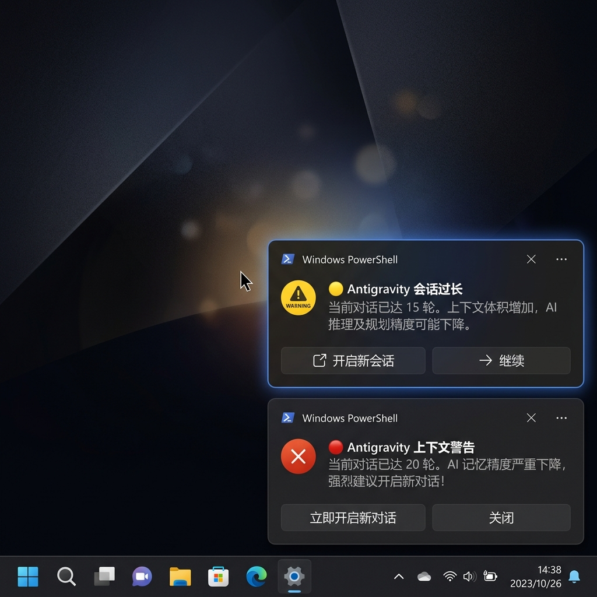

# Antigravity Context Monitor 🌌
> A lightweight, event-driven context length & token overflow monitor for LLM Agentic Coding tools (such as Antigravity and Gemini client). Prevents reasoning degradation in long chat sessions with 0-token overhead.



[English](#english) | [中文说明](#中文说明)

---

## English

### 🏷️ Recommended GitHub Repository Topics (Add these in your GitHub project sidebar!)
`gemini` | `context-window` | `llm-tools` | `agentic-coding` | `developer-tools` | `powershell-notification`

---

### 🌟 Why You Need This (The Developer Pain Point)
When building complex projects with LLM coding agents (like Gemini, Claude Code, or Antigravity), **context window bloat** is the silent killer. As conversations get longer:
1. **The "Dumb Zone"**: The AI loses reasoning precision, starts hallucinating, or repeats failed commands.
2. **Token Waste**: You waste thousands of API tokens re-sending the same files over and over.

This tool acts as a **local sentinel** that watches your agent's active log files and alerts you immediately when your context gets dangerously long, before you waste money and time.

---

### 🚀 Key Features

- **Zero AI Attention & Token Overhead**: Runs natively in the background as an OS-level watcher. It consumes absolutely no prompt tokens, saving your context window for actual coding.
- **Smart Locale Adaptation**: Detects system language dynamically to push toast notifications in either English or Chinese.
- **PowerShell Native Toast Banner**: Slides in beautifully in the bottom-right corner, integrating natively with Windows 10/11 Light/Dark modes.
- **Event-Driven Directory Watcher**: 0% idle CPU usage. Uses node's `fs.watch` to instantly detect log modifications when you send a prompt.
- **Project Path Filtering**: Targets only the active workspace to prevent noisy warnings when switching between other non-related projects.
- **Single-Instance Protection & Fault Tolerance**: Binds a local port to prevent duplicate notifier runs and safely recovers when you delete active chat logs in client.

---

### ⚙️ How It Works

The script monitors your local Antigravity runtime directory (`~/.gemini/antigravity/brain/`).
1. **🟡 Warning (Yellow Alert)**: Triggered when a conversation hits **12 rounds**, or when Antigravity executes **automatic history compression** (warning you that raw code details are now summarized/lost).
2. **🔴 Warning (Red Alert)**: Triggered when the chat hits **20 rounds**, strongly recommending opening a new conversation to avoid reasoning decay.

---

### 🛠️ Installation & Setup (Windows)

#### Prerequisites
- [Node.js](https://nodejs.org/) installed and available in your environment path.

#### Steps
1. Clone this repository to your machine:
   ```bash
   git clone https://github.com/RedPanda-Craft/antigravity-context-monitor.git
   cd antigravity-context-monitor
   ```

2. Run the script manually in your terminal to test:
   ```bash
   node watch_context.cjs "C:/path/to/your/project/workspace"
   ```
   *(Note: replace the path with your actual target workspace directory. If left blank, it defaults to the parent folder of the script).*

3. **Set Up Autostart (Run Silently in Background)**:
   - Press `Win + R`, type `shell:startup` and press **Enter** to open the Windows Startup folder.
   - Copy `start_antigravity_watcher.vbs` (or create a shortcut pointing to it) and place it inside that folder.
   - Right-click the `.vbs` file, open with Notepad, and edit the path to point to your cloned `watch_context.cjs` file.
   - **Double-click** the VBS file to start it immediately. It will run silently in the background with no command windows shown, and will automatically start every time you log into Windows!

---

## 中文说明

### 🌟 痛点背景

在使用大语言模型智能体（如 Gemini、Claude Code 或 Antigravity）进行复杂编码时，**上下文窗口膨胀（Context Window Bloat）** 是最常见的问题。随着对话增长：
1. **“笨拙区（Dumb Zone）”**：AI 的逻辑推理精度严重下降，开始产生幻觉或重复失败的指令。
2. **Token 浪费**：每次发送新消息，都要重发整个历史代码，造成大量的 API Token 浪费。

本工具作为 **本地哨兵**，实时监听 Agent 的活跃日志，在上下文即将溢出或被压缩前，通过系统原生通知向你发出警报。

---

### 🌟 功能特点

- **零 AI 注意力和 Token 消耗**：原生运行于宿主系统后台，绕过大模型的 Prompt 上下文，不占用任何上下文 Token。
- **双语自适应通知**：自动检测 Windows 系统语言环境，自适应弹出中文或英文系统通知。
- **PowerShell 原生 Toast 通知**：在屏幕右下角滑出干净的、系统主题风格的 Toast 消息横幅（支持 Windows 深浅色主题）。
- **完全事件驱动**：0% 空闲 CPU 占用。使用文件系统钩子（`fs.watch`）动态监听活跃对话。
- **智能工作区过滤**：识别对话所属的工作区，仅对你当前正在开发的活跃项目触发通知。
- **单例锁保护**：通过本地端口防重开机制，确保后台仅常驻唯一监听实例，防止重复弹窗。
- **健壮的容错机制**：安全处理历史记录删除、清空会话以及 XML 特殊字符转义。

---

### ⚙️ 工作原理

脚本会监听本地 Antigravity 运行目录 (`~/.gemini/antigravity/brain/`)：
1. **🟡 黄点警告**：当对话达到 **12 轮**，或检测到 Antigravity 执行了**自动历史压缩**（提醒你前期的具体代码细节与修改历史已被总结压缩，AI 失去精确记忆）。
2. **🔴 红点警告**：当对话达到 **20 轮**，强力建议开启新对话，防止 AI 进入推理能力退化的“笨拙区”。

---

### 🚀 安装与自启指南 (Windows)

#### 前置条件
- 系统已安装 [Node.js](https://nodejs.org/) 并已配置环境变量。

#### 安装步骤
1. 克隆仓库到本地：
   ```bash
   git clone https://github.com/RedPanda-Craft/antigravity-context-monitor.git
   cd antigravity-context-monitor
   ```

2. 在终端手动运行进行测试：
   ```bash
   node watch_context.cjs "C:/你的/项目/工作区路径"
   ```
   *(注：若不传路径，默认将监视脚本父级目录所代表的项目)*。

3. **配置开机静默自启**：
   - 按下 `Win + R` 输入 `shell:startup` 回车，打开 Windows 启动文件夹。
   - 将项目中的 `start_antigravity_watcher.vbs` 复制或创建快捷方式放入该文件夹。
   - 右键该 `.vbs` 文件，用记事本打开，修改其中的路径，指向你克隆 of `watch_context.cjs` 的绝对路径。
   - **双击运行** 该 VBS 启动脚本。它会在后台完全静默运行（无任何命令行窗口），且每次开机都会自动启动。

---

## 📄 License

MIT License.
